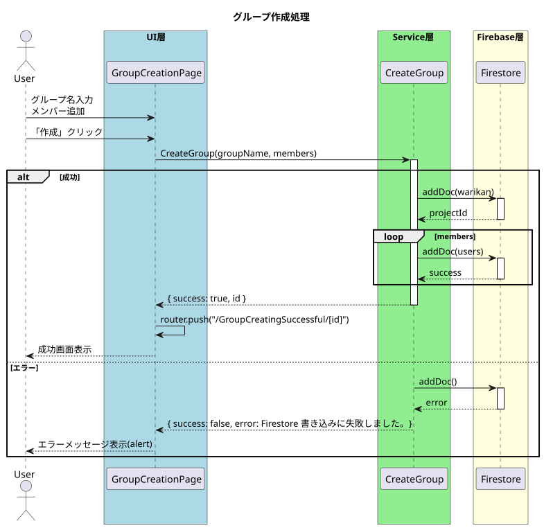
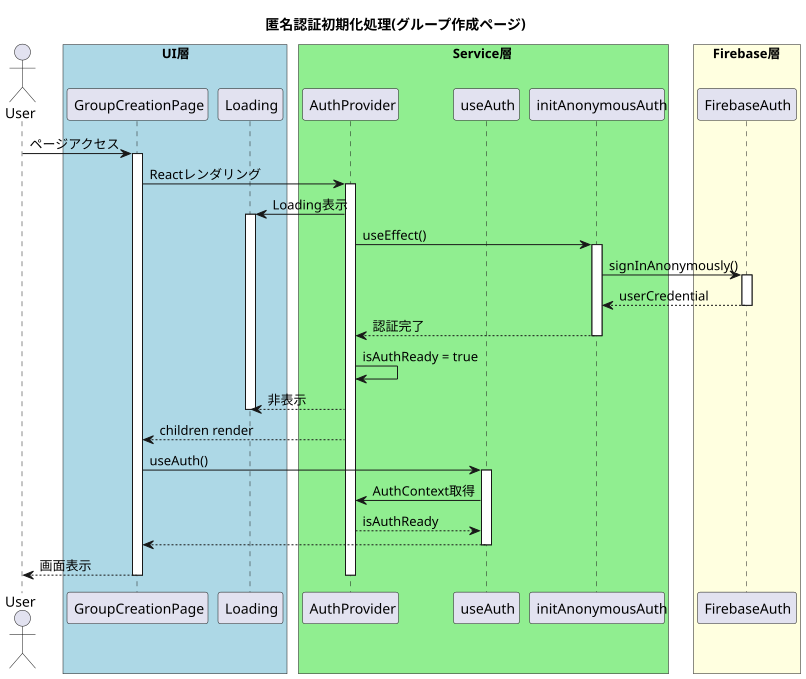
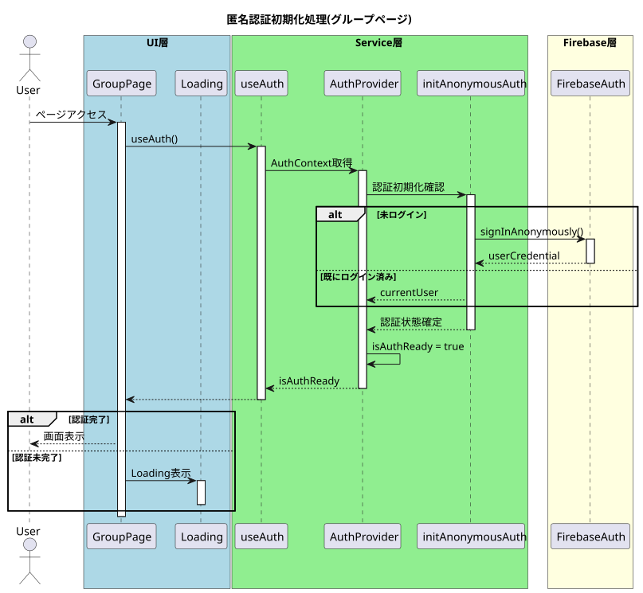
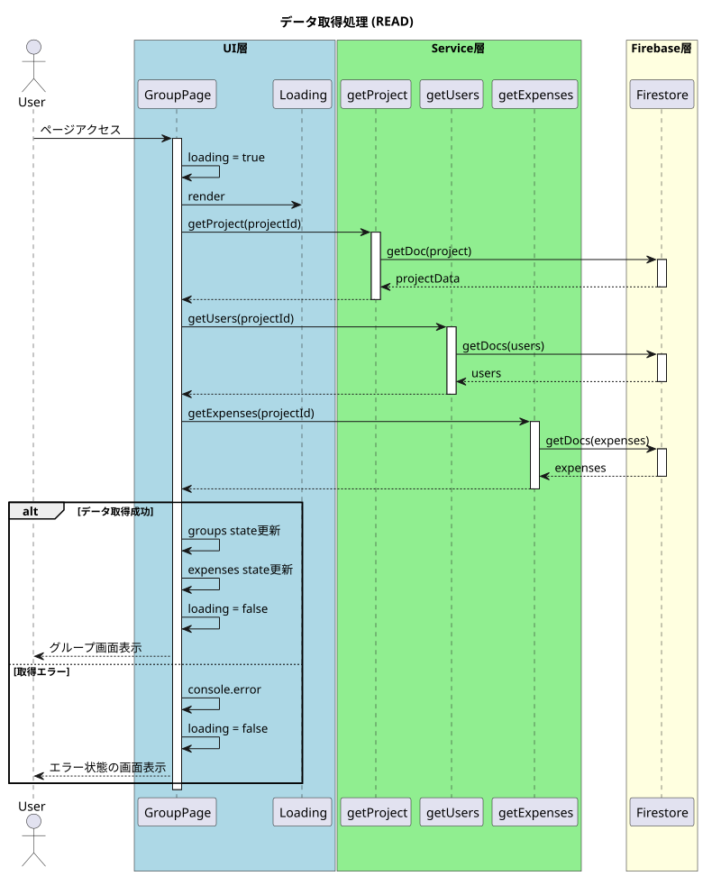
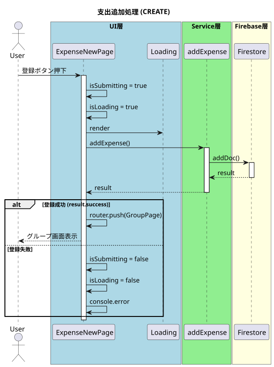
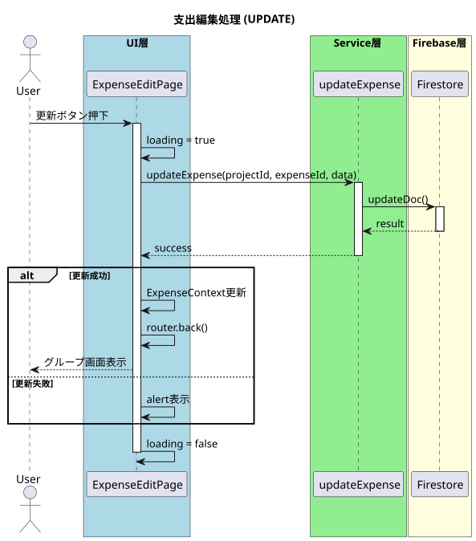
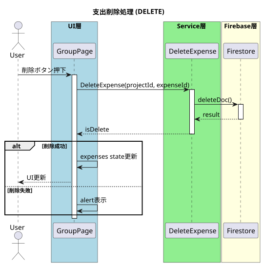
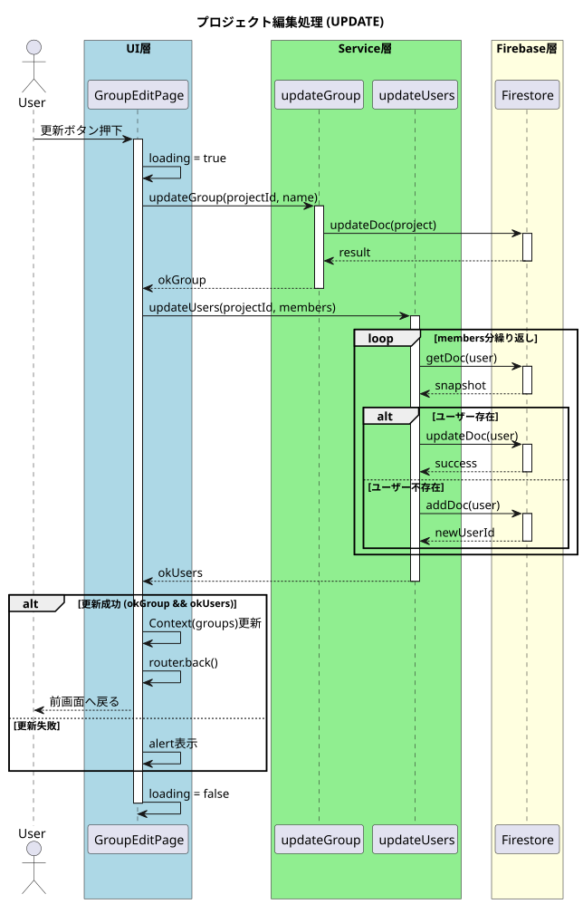

これは Next.js プロジェクトで、  
`create-next-app` を使って作成されています。

## はじめに（Getting Started）

まず、開発サーバーを起動します。

```bash
npm run dev
# または
yarn dev
# または
pnpm dev
# または
bun dev
```

ブラウザで
http://localhost:3000

を開くと、実行結果を確認できます。


## フォルダ構成
- app   
  アプリのファイルが格納されています。  
  - (page)  
    ページごとのファイルが格納されています。
    - Group  
      割り勘グループ管理画面※料金の追加・編集、メンバーの編集を行います。  
      - expense
         - edit  
           料金の編集を行います。
         - new  
           料金の追加を行います。
      - group-edit  
       割り勘グループ名、メンバーの編集を行います。
    - GroupCreatingSuccessful  
      グループ作成成功ページです。
    - GroupCreation  
      グループ作成ページです。
    - legal  
      アプリ規約等
      - privacy  
        プライバシーポリシー
      - terms  
        利用規約
  - components  
    部品の集合  
    - hooks  
    - model  
      DBとのやりとり  
    - provider  
      プロバイダー  
    - ui  
      uiの部品の集まり  
      
  - lib
    firebaseの設定

## シーケンス図

### グループ作成処理


---

### 匿名認証初期化処理

#### グループ作成ページ


#### グループページ


---

### CRUD処理

#### データ取得


#### 支出追加


#### 支出編集


#### 支出削除


#### プロジェクト編集


  
    
